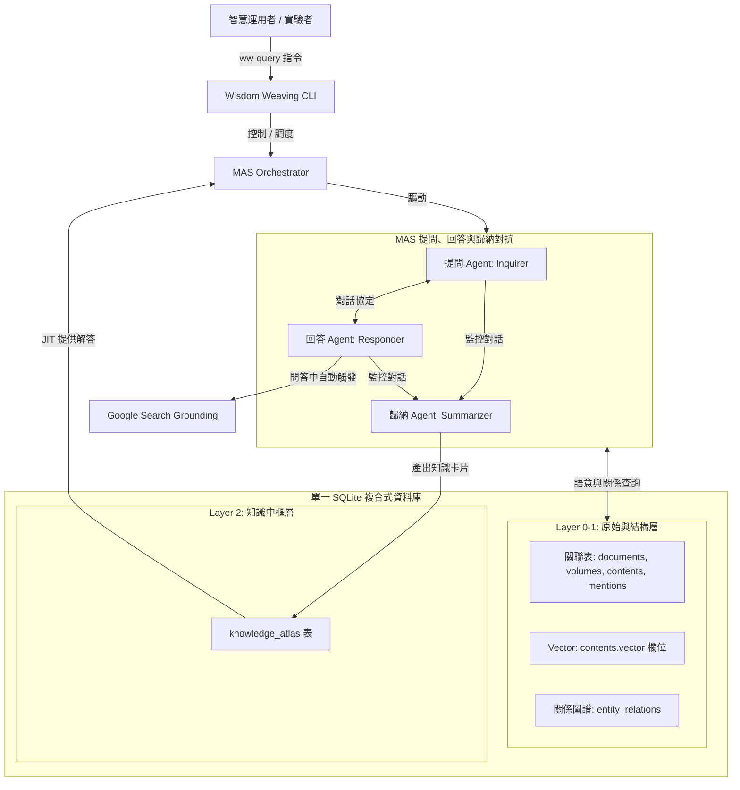

# 🧠 智慧工程沙盒實驗系統 (Wisdom Weaving)

[](#)
[](#)
[](#)

**Wisdom Weaving** 是一個通用的多代理人（Multi-Agent System, MAS）對抗、回答與歸納沙盒系統。專案旨在透過對抗性的對話迴圈，按需（Just-In-Time, JIT）將非結構化文本轉化為結構化的 Layer 2 專題知識體系（Knowledge Atlas）。

本專案實作 POC 以《鹿鼎記》之「多重情感與利益衝突角力」為首個實踐沙盒，展示人機協作下的知識工程厚化。

---

## 🌟 核心特色 (Core Features)

1.  **L0-L1-L2 三層式 SQLite 資料庫**
    - 完全對合 HGIS 溯源框架，免除外部複雜的圖資料庫與向量資料庫依賴，將關聯資料、向量索引與 ER 關係圖譜全部固化在單一輕量級 SQLite 資料庫內。
2.  **強韌的本地離線向量檢索與 Fallback**
    - 原生整合完全本地離線的中文 TF-IDF/Bigram 向量生成與 Cosine 相似度語意檢索，能完美在無網路或外部 API 阻擋時執行強韌降級，確保流程 100% 跑通。
3.  **JIT 按需回答與增量厚化**
    - 智慧空缺檢測機制：使用者發起查詢時，若 L2 知識中樞已有快取則秒回；若缺失，則自動驅動 MAS 對角問答進行實時增量建置。
4.  **版權隔離與合規工具鏈**
    - 釋出前一鍵剝離 Layer 1 的原始小說文本（抹除 `raw_text`），僅保留結構、ID、embeddings 與 L2 卡片；本地部署後提供一鍵重建工具，對齊本地原著還原小說本文，完美隔離著作權糾紛。

---

## 📅 系統架構 (System Architecture)

系統控制流與資料流如下圖所示：



### 四維度語意特徵空間
歸納 Agent 在產製知識卡片時，會將問答精華映射至四維度情感與關係特徵空間中：
-   **地緣政治度 ($V_{geo}$)**：派系勢力與版圖拉扯。
-   **身份隱密隔離度 ($V_{iso}$)**：多重身份間資訊隔離防穿幫機制。
-   **親密度與恩情強度 ($V_{loy}$)**：剛性道德羈絆與誓言契約強度。
-   **利益衝突烈度 ($V_{con}$)**：資源與權力博弈上的對抗程度。

---

## 📂 目錄結構 (Directory Architecture)

```
wisdom-weaving/
├── sys_eng/                    # 系統工程Living Documents (需求、規格、設計、測試、釋出)
│   ├── README.md               # 系統工程導航總覽與版本進度看板
│   ├── 01_requirements/        # 需求定義 (req_vision.md)
│   ├── 02_specification/       # 功能與技術規格
│   ├── 03_design/              # 架構設計與 DDL DSN
│   └── 05_verification_testing/# 測試計畫與測試案例 (test_plan.md)
├── VERSION.md                  # 專案版本狀態與變更日誌 (Changelog)
├── justfile                    # 專案快捷指令定義檔
├── scripts/                    # 依分類存放的治理腳本
│   └── wisdom_weaving/         # v0.1.1 核心實作套件目錄
│       ├── __init__.py
│       ├── db_manager.py       # 資料庫配接與動態 DDL 初始化 API
│       ├── restorer.py         # L1 版權文本一鍵剝離與地端還原對齊 API
│       ├── bootstrap.py        # 文本段落切片與無版權模擬文本生成 API
│       └── cli.py              # 入口 CLI 指令與引數調度實作
```

---

## 🚀 使用者指南 (Usage Guide)

本專案實作了入口級的 CLI 工具 `scripts/wisdom_weaving/cli.py`。使用者可以針對**不同的文本來源建立獨立的資料庫**，且所有指令皆支援指定資料庫運行。

為了降低指令輸入摩擦，我們一併在子專案根目錄下配置了 `justfile`。您可以使用 **標準 Python 命令** 或 **Just 快捷指令** 來進行操作：

### 1. 全域參數：指定資料庫
所有的子指令都支援全域可選參數 `-d / --db <資料庫路徑>`。如果未提供，系統預設會使用 `events/wisdom-core/wisdom-weaving/wisdom_weaving.db`。這能確保多文本的知識與數據物理隔離，避免交叉污染。

### 2. 初始化與文本載入 (init)
當您拿到一個新文本時，您必須先進行資料庫初始化與切片載入：

*   **方式 A：自動生成並載入無版權「模擬權謀文本」（沙盒實驗推薦）**
    這會在指定路徑動態建立資料庫，並載入內建的虛擬朝野與江湖博弈文本：
    ```bash
    # 標準 Python 命令
    PYTHONPATH=. python -m scripts.wisdom_weaving.cli --db events/wisdom-core/wisdom-weaving/ludingji_mock.db init --simulation

    # 快捷 Just 命令對照
    just init db=events/wisdom-core/wisdom-weaving/ludingji_mock.db
    ```
*   **方式 B：載入指定的本地文本檔案**
    這會自動對文本進行段落切片，並寫入 `contents` 表，同時記錄字元偏移量（offset metadata）以備未來地端還原：
    ```bash
    # 標準 Python 命令
    PYTHONPATH=. python -m scripts.wisdom_weaving.cli --db events/wisdom-core/wisdom-weaving/custom.db init --text path/to/your_text.txt

    # 快捷 Just 命令對照
    just init db=events/wisdom-core/wisdom-weaving/custom.db text=path/to/your_text.txt
    ```

### 3. 版權防禦一鍵剝離 (strip)
當專案成果需要公開發布或分享至開源社群時，為了防範小說著作權版權糾紛，執行此命令將會一鍵抹除 `contents` 表中所有段落的 `raw_text`，但完整保留結構 ID、向量 Embeddings 與 L2 知識 Atlas：
```bash
# 標準 Python 命令
PYTHONPATH=. python -m scripts.wisdom_weaving.cli --db events/wisdom-core/wisdom-weaving/ludingji_mock.db strip

# 快捷 Just 命令對照
just strip db=events/wisdom-core/wisdom-weaving/ludingji_mock.db
```

### 4. 地端小說原著還原對齊 (restore)
公開下載了已被剝離的資料庫後，使用者可以在本地指定其所擁有的原著小說檔案。工具會依據 contents 表中原先儲存的 offset 偏移量，自動從原著中 Slice 出對應段落並對齊重寫回 `raw_text`，完成 Layer 1 地端重建：
```bash
# 標準 Python 命令
PYTHONPATH=. python -m scripts.wisdom_weaving.cli --db events/wisdom-core/wisdom-weaving/ludingji_mock.db restore --text path/to/local_novel_file.txt

# 快捷 Just 命令對照
just restore path/to/local_novel_file.txt db=events/wisdom-core/wisdom-weaving/ludingji_mock.db
```

### 5. 系統性查詢與 JIT 演進 (query)
在指定的目標資料庫中發起系統性詢問。系統會先檢索 Layer 2 專題知識，若快取未命中則自動觸發 JIT 對抗與聯網機制：
```bash
# 標準 Python 命令
PYTHONPATH=. python -m scripts.wisdom_weaving.cli --db events/wisdom-core/wisdom-weaving/ludingji_mock.db query "隱羽門的背叛風險與資訊隔離防禦分析"

# 快捷 Just 命令對照
just query "隱羽門的背叛風險與資訊隔離防禦分析" db=events/wisdom-core/wisdom-weaving/ludingji_mock.db
```

---

## 🛡️ 腳本開發治理守則

所有貢獻至此 Repository 的程式碼皆必須嚴格遵守以下治理守則：
1.  **子目錄歸類**：新腳本嚴禁放置於 `scripts/` 根目錄下，必須歸入如 `scripts/wisdom_weaving/` 等子目錄，且目錄下必須包含 `__init__.py`。
2.  **元數據標註**：腳本頂部 Docstring 必須包含 `[metadata]` 區塊說明標題與功能，並執行 `generate_index.py` 同步更新索引。
3.  **API/CLI 雙向相容**：核心業務邏輯必須封裝於函式中，嚴禁直接呼叫 `sys.exit()`，失敗時一律拋出 Exception。
