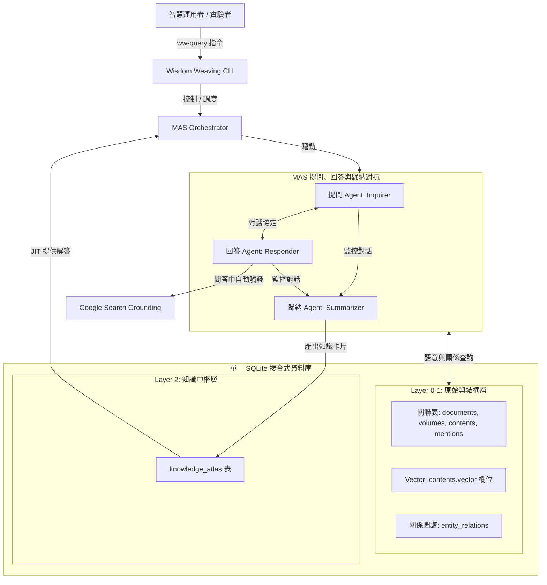

# 🧠 智慧工程沙盒實驗系統 (Wisdom Weaving)

[](#)
[](#)
[](#)

**Wisdom Weaving** 是一個通用的多代理人（Multi-Agent System, MAS）對抗、回答與歸納沙盒系統。專案旨在透過對抗性的對話迴圈，按需（Just-In-Time, JIT）將非結構化文本轉化為結構化的 Layer 2 專題知識體系（Knowledge Atlas）。

本專案實作 POC 以《鹿鼎記》之「多重情感與利益衝突角力」為首個實踐沙盒，展示人機協作下的知識工程厚化。

---

## 🌟 核心特色 (Core Features)

1.  **L0-L1-L2 三層式 SQLite 資料庫**
    - 完全對合 HGIS 溯源框架，免除外部複雜的圖資料庫與向量資料庫依賴，將關聯資料、向量索引與 ER 關係圖譜全部固化在單一輕量級 SQLite 資料庫內。
2.  **強韌的本地離線向量檢索與 Fallback**
    - 原生整合完全本地離線的中文 TF-IDF/Bigram 向量生成與 Cosine 相似度語意檢索，能完美在無網路或外部 API 阻擋時執行強韌降級，確保流程 100% 跑通。
3.  **JIT 按需回答與增量厚化**
    - 智慧空缺檢測機制：使用者發起查詢時，若 L2 知識中樞已有快取則秒回；若缺失，則自動驅動 MAS 對角問答進行實時增量建置。
4.  **版權隔離與合規工具鏈**
    - 釋出前一鍵剝離 Layer 1 的原始小說文本（抹除 `raw_text`），僅保留結構、ID、embeddings 與 L2 卡片；本地部署後提供一鍵重建工具，對齊本地原著還原小說本文，完美隔離著作權糾紛。

---

## 📅 系統架構 (System Architecture)

系統控制流與資料流如下圖所示：



### 四維度語意特徵空間
歸納 Agent 在產製知識卡片時，會將問答精華映射至四維度情感與關係特徵空間中：
-   **地緣政治度 ($V_{geo}$)**：派系勢力與版圖拉扯。
-   **身份隱密隔離度 ($V_{iso}$)**：多重身份間資訊隔離防穿幫機制。
-   **親密度與恩情強度 ($V_{loy}$)**：剛性道德羈絆與誓言契約強度。
-   **利益衝突烈度 ($V_{con}$)**：資源與權力博弈上的對抗程度。

---

## 📂 目錄結構 (Directory Architecture)

```
wisdom-weaving/
├── sys_eng/                    # 系統工程Living Documents (需求、規格、設計、測試、釋出)
│   ├── 00_buildlogs/           # 專案建置與行為學習計畫書
│   ├── 01_requirements/        # 需求定義 (req_vision.md)
│   ├── 02_specification/       # 功能與技術規格
│   ├── 03_design/              # 架構設計與 DDL DSN
│   └── 05_verification_testing/# 測試計畫 (test_plan.md)
├── data/                       # 原始文本與模擬數據
│   ├── mock_ludingji_love.txt  # 以情感與利益衝突為素材的初始模擬故事
│   └── .vector_model.json      # 本地向量特徵模型中繼資料
├── app/                        # 專案 Python 核心原始碼
│   ├── main.py                 # 入口 CLI 實作
│   ├── agents/                 # MAS Agent 拓本與 System Prompts
│   └── services/               # JIT 服務與 Cache 邏輯
├── scripts/                    # 依分類存放的治理腳本
│   ├── database/               # 初始化、向量更新、剝離、重建腳本
│   └── research/               # 文本切片與實體 mentions 標註
└── tests/                      # 測試案例
```

---

## 🚀 快速開始 (Quick Start)

專案已在根目錄配置了快捷指令集（基於 `just`），您可以直接在終端機中執行：

### 1. 系統一鍵初始化
建置 SQLite 資料庫結構、讀取模擬文本進行段落切片與實體標註、並計算本地 RAG 語意向量：
```bash
just ww-init
```

### 2. 智慧 JIT 檢索與專題建置
查詢特定情感與關係問題，系統會自動在 Cache 檢索；若缺失，則自動驅動問答對抗迴圈進行增量厚化：
```bash
# 第一次查詢 (Miss，觸發 Agent 動態對抗建置)
just ww-query "分析韋小寶如何利用身分隔離防穿幫"

# 第二次查詢 (Hit Cache，秒回)
just ww-query "分析韋小寶如何利用身分隔離防穿幫"
```

### 3. 版權隔離保護與地端還原
專案發布前一鍵抹除 contents 表的小說原始文本，保留結構與向量；使用者下載後指定本地文本一鍵還原：
```bash
# 一鍵剝離文本 (發布前)
just ww-strip

# 一鍵地端重建還原
just ww-restore
```

---

## 🛡️ 腳本開發治理守則

所有貢獻至此 Repository 的程式碼皆必須嚴格遵守以下治理守則：
1.  **子目錄歸類**：新腳本嚴禁放置於 `scripts/` 根目錄下，必須歸入如 `scripts/database/` 等子目錄，且目錄下必須包含 `__init__.py`。
2.  **元數據標註**：腳本頂部 Docstring 必須包含 `[metadata]` 區塊說明標題與功能，並執行 `generate_index.py` 同步更新索引。
3.  **API/CLI 雙向相容**：核心業務邏輯必須封裝於函式中，嚴禁直接呼叫 `sys.exit()`，失敗時一律拋出 Exception。
