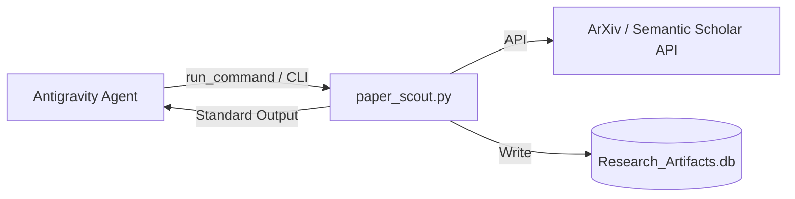

# Antigravity CLI Tooling Specification: Paper Scout (線上學術文獻探勘腳本)

本規格定義了 **Paper Scout** 在 Antigravity (具備 Shell 執行權限之 Agentic AI) 環境下的直連調用規範。本工具拋棄複雜的 MCP 伺服器包裝，直接以高效率的 **Python CLI 命令行介面** 提供文獻探勘與本地真值庫沈澱服務。

---

## 1. 核心設計哲學 (Core Philosophy)

*   **零 MCP 開銷**：不需要在背景常駐 stdio 守護進程，免去 JSON-RPC 解析開銷與配置檔綁定。
*   **直捷控制**：Antigravity 可以直接呼叫 Python 腳本、傳遞動態參數、並以 Markdown 格式直接閱讀與定錨結果，或以 JSON 格式獲取結構化物件進行後續腳本化處理。
*   **沙盒降級**：在 IDE 沙盒網路受限時自動退避至離線模擬，確保 Agent 工作流之功能測試具備 100% 確定性。

---

## 2. 命令行介面與參數矩陣 (CLI Arguments)

*   **呼叫指令**：`python3 /Users/wuulong/github/bmad-pa/scripts/research/paper_scout.py [ARGS]`

| 參數 | 類型 | 說明 | 範例與預設值 |
| :--- | :--- | :--- | :--- |
| `--query` | `str` | 搜尋文獻關鍵字 (必填，支援英文、空白與布林邏輯) | `--query "QMEMS resonator"` |
| `--source` | `str` | 文獻來源分類 | `arxiv` / `sem-scholar` / `all` (預設: `all`) |
| `--limit` | `int` | 單一來源最大返回筆數 | `--limit 3` (預設: `5`) |
| `--save-db` | `flag` | 是否將檢索到的文獻直接寫入本地 SQLite 資料庫 | `--save-db` (若加入，則自動落庫) |
| `--output` | `str` | 輸出格式 | `markdown` (LLM 閱讀) / `json` (腳本解析) |
| `--force-mock` | `flag` | 強制啟用本地離線模擬模式 (不發送網路請求) | `--force-mock` |

---

## 3. Antigravity 最佳實踐調用場景 (Best Practice Workflows)

### 場景 A：文獻定錨與快速閱讀 (Grounding Mode)
當 Antigravity 需要對特定研究進行背景調查時，應直接呼叫並獲取 Markdown 格式的對照表：
*   **指令**：`python3 /Users/wuulong/github/bmad-pa/scripts/research/paper_scout.py --query "QMEMS 5G" --limit 3`
*   **效果**：直接在對話中返回排版美觀的文獻表格與 PDF 連結，作為後續推理的真值。

### 場景 B：學術成果落庫沉澱 (DB Ingestion Mode)
當學生或 Agent 找到確定有參考價值的關鍵文獻時，應呼叫腳本直接將其結構化寫入資料庫：
*   **指令**：`python3 /Users/wuulong/github/bmad-pa/scripts/research/paper_scout.py --query "Mindlin plate theory quartz" --limit 2 --save-db`
*   **效果**：自動拉取元數據，對齊 Schema 後寫入 `/Users/wuulong/github/bmad-pa/data/research/Research_Artifacts.db` 的 `papers` 表中。

### 場景 C：本地研究數據唯讀分析 (Analytics Mode)
Antigravity 可以直接使用 SQLite CLI 對落庫的論文進行高維度 SQL 查詢與比對：
*   **指令**：`sqlite3 /Users/wuulong/github/bmad-pa/data/research/Research_Artifacts.db "SELECT paper_id, title FROM papers WHERE year >= 2025"`

---

## 4. 沙盒退避與開發除錯 (Debug & Sandbox Fallback)
*   **自動 fallback 機制**：若網路 API 連線逾時（Timeout）或回報 429，腳本會自動在終端機打印 `⚠️ 偵測到網路連線受阻...自動啟動【本地離線模擬模式】`，並生成結構完全合致的 QMEMS 測試文獻寫入資料庫。
*   **除錯優勢**：在 Antigravity 執行時，若發現 Schema 異動，可以直接使用 `replace_file_content` 工具修改 `paper_scout.py` 中的 `save_to_sqlite` 函數，無須重新啟動或重載 MCP 伺服器，具備「即時熱修復」之極致敏捷性。
