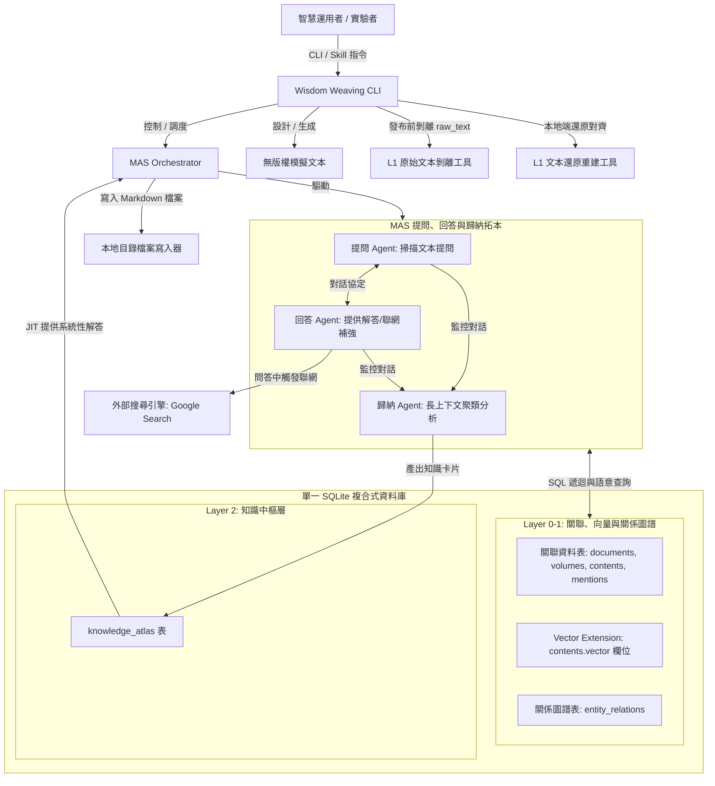
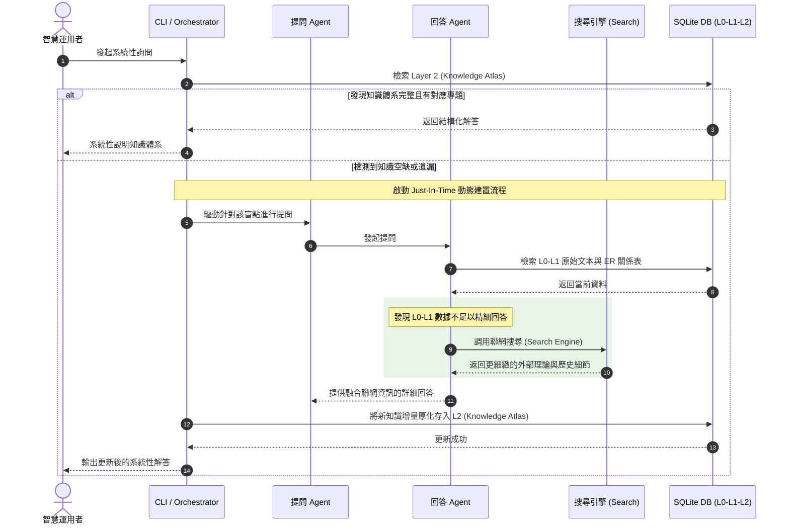

# 03. 系統架構設計說明書 (System Architecture Design)

本文件描述專案 **`Wisdom Weaving`** 的軟體架構、模組切分、元件互動關係，將規格書 (`02_specification/`) 中的邏輯規格，轉化為物理元件與控制流的配置設計。本系統的架構基石為 **「HGIS 三層知識建模架構 + SQLite 原生 Vector 檢索 + SQLite 關係表圖譜」** 的單一資料庫融合。

---

## 1. 系統總體架構與 Tiered 結構對合

本系統資料底座統一採用單一 **SQLite** 資料庫（對合 L0-L1-L2 三層架構），避免引進外部複雜的 Neo4j / 向量資料庫，以確保專案能輕量化地開源發佈與釋出。



---

## 2. 複合式資料底層設計 (DB + Vector DB + ER Graph DB)

本系統融合三種不同的資料能力，全部統一在單一 SQLite 資料庫內實現：
* **關聯式 SQL & JSON Metadata**：負責 Layer 0 與 Layer 1 提及引用之維護。藉由外鍵關係與 JSON 格式 metadata，將文件 (`documents`)、卷/章節 (`volumes`)、切片文本 (`contents`) 與引用提及 (`mentions`) 進行強關聯。
* **Vector DB 語意檢索**：在 `contents` 原生整合向量欄位與索引（載入 `sqlite-vss` 或同等向量模組），當 Agent 或使用者發起自然語言查詢時，支援語意相似度檢索。
* **ER 關係與語意圖譜**：在 SQLite 內建立 `entity_relations` 表，定義實體間多層、多維的關係屬性 JSON（如 `loyalty_value`、`betrayal_risk`），利用 SQL 遞迴查詢（CTE）或 Python 腳本來進行多層圖譜推理與查詢，從而免除對外部圖資料庫的依賴。

---

## 3. MAS 拓本與提問-歸納對話流算法設計

為了防止大模型的上下文內爆與角色認知模糊，本系統採用微服務化、各司其職的 Multi-Agent 對抗與歸納拓本結構。代理人網絡的開發必須依循 `antigravity SDK` 的設計模式。

### 3.1 Agent 職責與 Persona 提示詞策略

系統定義三個核心 Agent，並透過專屬的 Persona 提示詞（System Prompts）進行約束：

*   **提問 Agent (Inquirer)**:
    *   **Persona 設定**: 批判性知識盲點挖掘官。
    *   **提示詞策略**: 「你是一位極度嚴謹且具備批判性思維的系統分析師。你的任務是閱讀當前文本切片，找出情節、概念、人物動機、身份矛盾中的『邏輯空白』或『資訊不對稱點』，並以強型別 Schema 發起高質量的提問。你必須不斷追問，直到對方的回答無法提供更多結構化情報為止。」
*   **回答 Agent (Responder)**:
    *   **Persona 設定**: 領域專家與聯網檢索器。
    *   **提示詞策略**: 「你是一位精通該文本背景（例如該領域專門術語、背景理論）的專家。你必須依據 Layer 0-1 的 SQLite 資料與 ER 關係表提供事實回答。如果 L0-L1 的本地數據不足以解答提問，你必須調用外部搜尋引擎（Google Search）獲取細緻的背景理論，並將新資訊融入回答。」
*   **歸納 Agent (Summarizer)**:
    *   **Persona 設定**: 大歷史語義架構師。
    *   **提示詞策略**: 「你不參與問答。你的任務是全程監控提問 Agent 與回答 Agent 的多輪對話歷史，利用長上下文窗口進行語意聚類分析，歸納出實體間的引用網絡，並計算該主題在多維向量空間中的座標，最後以 `knowledge_atlas` 的 JSON 格式輸出專題知識卡片。」

---

### 3.2 提問-歸納對話流演算法 (Dialogue Loop Algorithm)

以下為在 `google-antigravity` 環境中運行該 MAS 對抗與知識萃取迴圈的算法虛擬代碼：

```python
# python (pseudo-code representation conforming to antigravity SDK standards)
from typing import List, Dict
import json
from pydantic import BaseModel, Field

# 1. 宣告強型別數據交換 Schema (Pydantic)
class QuestionSchema(BaseModel):
    query_id: str
    target_focus: List[str] = Field(..., description="本次提問關注的實體或概念點")
    question_text: str = Field(..., description="具體的批判性提問內容")
    is_terminate: bool = Field(False, description="若認為當前概念已挖掘完畢，設為 True 以終止對話")

class AnswerSchema(BaseModel):
    answer_id: str
    answer_text: str = Field(..., description="結合本地 DB 與聯網查詢後的詳細解答")
    internet_searched: bool = Field(False, description="是否執行了聯網補強")
    source_citations: List[str] = Field(default=[], description="參考的原始文獻或聯網 URL")

# 2. 核心 MAS 對話流與歸納算法
def run_wisdom_weaving_loop(target_subject: str, context_init: dict, max_rounds: int = 5) -> dict:
    """
    對抗問答與知識萃取的核心算法 (通用型架構)
    """
    dialogue_history: List[Dict] = []
    current_context = context_init
    
    print(f"【MAS 啟動】開始針對主題 [{target_subject}] 進行對抗建構...")
    
    # 進行多輪對話
    for round_num in range(1, max_rounds + 1):
        # Step 1: 提問 Agent 發起提問
        inquirer_prompt = render_prompt("inquirer_persona.md", subject=target_subject, history=dialogue_history)
        question_json = call_llm_agent(role="Inquirer", prompt=inquirer_prompt, schema=QuestionSchema)
        question: QuestionSchema = QuestionSchema.model_validate(question_json)
        
        # 記錄提問
        dialogue_history.append({
            "round": round_num,
            "agent": "Inquirer",
            "payload": question.model_dump()
        })
        print(f"  [Round {round_num}] Inquirer Q: {question.question_text}")
        
        # 檢查 Inquirer 是否主動發起終止信號
        if question.is_terminate:
            print("  --> Inquirer 發起 TERMINATE 信號，結束對話對抗。")
            break
            
        # Step 2: 回答 Agent 生成解答
        responder_prompt = render_prompt("responder_persona.md", question=question.question_text, current_db_context=current_context)
        answer_json = call_llm_agent(role="Responder", prompt=responder_prompt, schema=AnswerSchema)
        answer: AnswerSchema = AnswerSchema.model_validate(answer_json)
        
        # 記錄回答
        dialogue_history.append({
            "round": round_num,
            "agent": "Responder",
            "payload": answer.model_dump()
        })
        print(f"  [Round {round_num}] Responder A: {answer.answer_text} (聯網補強: {answer.internet_searched})")
        
        # 更新本地上下文快取，便於下輪檢索
        current_context = update_temporary_context(current_context, answer)
        
    # Step 3: 對話終止後，由 Summarizer 進行長上下文歸納
    print("【MAS 歸納】對話結束，Summarizer 開始進行長上下文聚類與知識卡片產製...")
    summarizer_prompt = render_prompt("summarizer_persona.md", subject=target_subject, history=dialogue_history)
    
    # 產出 Layer 2 知識卡片
    knowledge_atlas_payload = call_llm_agent(role="Summarizer", prompt=summarizer_prompt, schema=dict)
    
    # 將卡片寫入 SQLite Layer 2 表中
    save_to_knowledge_atlas(knowledge_atlas_payload)
    print("【成功】Layer 2 知識卡片已成功儲存至 SQLite knowledge_atlas！")
    
    return knowledge_atlas_payload
```

---

### 3.3 長上下文聚類與知識多維空間映射

歸納 Agent (Summarizer) 在產製知識卡片時，必須將多輪問答所萃取出的「語意特徵」，映射至一個四維的向量空間中。這構成了知識體系的多維度坐標，用以作為未來語意索引與關聯檢索的數學特徵：

*   **空間維度定義**:
    1.  **地緣政治度 (Geopolitical Dimension, $V_{geo}$)**: 評估本知識主題涉及地域開發、行政邊界劃分、權力分配等政治空間的關聯烈度。值域 $[0.0, 1.0]$。
    2.  **身份隱密隔離度 (Identity Isolation Dimension, $V_{iso}$)**: 評估本知識主題在多重衝突身份、秘密資訊傳遞、保密快取隔離等資訊不對稱策略上的涉入度。值域 $[0.0, 1.0]$。
    3.  **親密度與恩情強度 (Loyalty & Gratitude Dimension, $V_{loy}$)**: 評估本知識主題中角色或實體間的剛性道德羈絆、恩義價值、誓言契約之關聯強度。值域 $[0.0, 1.0]$。
    4.  **利益衝突烈度 (Interest Conflict Dimension, $V_{con}$)**: 評估本知識主題中不同組織、勢力、利益派系在實體資源、權力博弈上的對抗程度。值域 $[0.0, 1.0]$。

*   **空間映射輸出格式 (通用 Schema)**:
    產出的 L2 知識卡片 JSON Payload 必須強制符合以下通用映射結構：
    ```json
    {
      "subject": "主題名稱",
      "dimension_vectors": {
        "geopolitical_correlation": 0.0,
        "identity_isolation": 0.0,
        "loyalty_and_gratitude": 0.0,
        "interest_conflict": 0.0
      },
      "nodes": [
        {"id": "NODE_ID", "name": "Entity_Name", "role": "Role_Description"}
      ],
      "edges": [
        {"source": "NODE_ID_A", "target": "NODE_ID_B", "relation": "Relation_Type", "properties": {"strength": 0}}
      ],
      "synthesis_insight": "大歷史語義綜整分析洞察與長文本摘要。"
    }
    ```

---

### 3.4 實作驗證範例：以《鹿鼎記》為例 (Case Study: Ludingji Novel)

為建置與驗證上述通用方法論，系統在實作 POC 時選定《鹿鼎記》作為首個實踐沙盒。以下為當通用架構套用至《鹿鼎記》時的具體映射與 Payload 實例：

*   **四維空間維度實體映射**:
    1.  **地緣政治度 ($V_{geo}$)**: 評估韋小寶面臨的大清帝國與天地會、神龍教、沐王府之地緣版圖角力。
    2.  **身份隱密隔離度 ($V_{iso}$)**: 評估「小桂子」、「韋香主」、「白龍使」、「韋爵爺」等多重身份之間的秘密資訊隔離防穿幫機制。
    3.  **親密度與恩情強度 ($V_{loy}$)**: 評估陳近南對韋小寶的師徒之恩（$V_{loy} = 0.95$），用以做為行動阻斷之剛性紅線。
    4.  **利益衝突烈度 ($V_{con}$)**: 評估康熙帝剿滅天地會的政治維穩利益，與天地會反清復明目標的衝突強度。

*   **Layer 2 知識卡片 Payload 實例 (韋小寶身份隔離防穿幫)**:
    ```json
    {
      "subject": "多重身分資訊隔離防禦演算法",
      "dimension_vectors": {
        "geopolitical_correlation": 0.35,
        "identity_isolation": 0.95,
        "loyalty_and_gratitude": 0.80,
        "interest_conflict": 0.90
      },
      "nodes": [
        {"id": "E-001", "name": "韋小寶", "role": "多重身份持有人"},
        {"id": "E-002", "name": "康熙", "role": "朝廷系統最高算力"},
        {"id": "E-003", "name": "陳近南", "role": "天地會系統領袖"}
      ],
      "edges": [
        {"source": "E-001", "target": "E-002", "relation": "君臣/朋友", "properties": {"trust": 90}},
        {"source": "E-001", "target": "E-003", "relation": "師徒/盟友", "properties": {"gratitude": 95}}
      ],
      "synthesis_insight": "在朝廷剿滅令與天地會刺殺令雙向衝突時，韋小寶透過延遲天地會的秘密傳播，同時對康熙隱瞞沐王府小郡主身分，在 $V_{iso}=0.95$ 與 $V_{con}=0.90$ 的高壓空間下實現了動態平衡。"
    }
    ```

---

---

## 4. JIT 按需動態建置與問答聯網查詢機制設計

本系統遵循 **Just-In-Time (JIT)** 運作原則。知識體系的建置主要在問答互動過程中「按需」觸發，特別是當系統發現「遺漏的知識」時，自動聯網獲取理論基礎並增量補強。



---

## 5. 自動化建置與持續演進 Skill 設計

自訂 Skill `wisdom-weaving` 提供文本提供時的「一鍵初始化（Bootstrap）」與「背景持續演進（Evolution）」：
* **`init [文本路徑]`**：將原始文本匯入為 Layer 0 檔案，並自動觸發基礎的實體萃取（L1）與資料表關聯配置。
* **`run [演進模式]`**：掛載背景任務或生命週期觸發器。在使用者發起提問時，動態驅動提問-歸納 Agent 對抗鏈，並按需執行聯網厚化。

---

## 6. 入口 CLI 與腳本治理設計

為落實 `script-governor` 規範，系統拒絕在大模型內以 Ad-hoc 方式執行複雜運算與資料庫操作：
* **統一入口 CLI**：提供 `wisdom-weaving` CLI，包含：
  - `wisdom-weaving init <source_text>`
  - `wisdom-weaving query <user_prompt>`
  - `wisdom-weaving restore --text <local_path>`（對齊與重建 L1 原始文本）
* **獨立腳本治理**：資料庫建立、向量生成、網頁爬蟲與 Markdown 產製全部寫成獨立的 Python 腳本，放在 `scripts/` 的適當子目錄下。每個腳本必須遵循 API/CLI 雙向相容架構，且附有 `scripts/manuals/` 中的 Markdown 使用手冊說明書。

---

## 7. 輕量核心 POC 限制與公開釋出合規性

* **POC 核心限制**：在驗證階段，僅加載《鹿鼎記》之「單一章節」或「單一特定主題」作為 POC 核心。在進行 POC 時，應優先設計與生成一組不具版權糾紛的「無版權模擬文本」作為核心實驗範例，以供公開展示。
* **公開釋出之 L1 文本剝離機制**：
  - 當專案發佈至公開社群時，發佈工具將執行 `UPDATE contents SET raw_text = '';`。
  - 此時 SQLite DB 將剝離 Layer 1 的小說原始文本內容（抹除 raw_text），僅保留結構、ID、向量數據與 Layer 2 知識 Atlas，從而避免版權著作權糾紛。
  - 使用者在本地部署後，可利用 `wisdom-weaving restore` 工具指定其本地端的小說原著，工具將自動進行對齊，將 raw_text 重建回 Layer 1。
